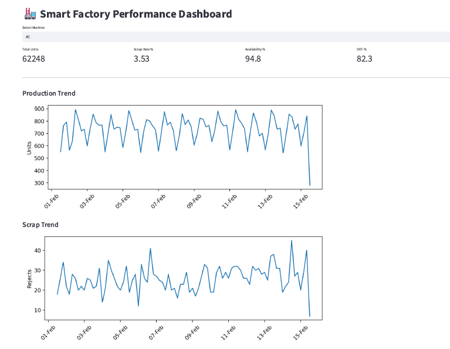
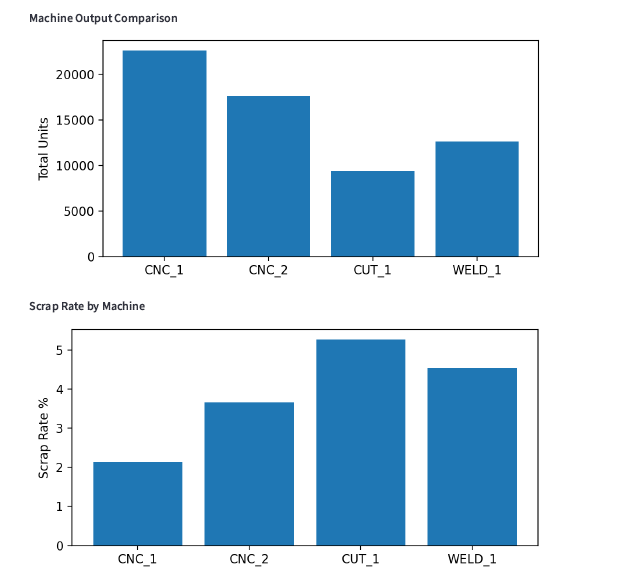
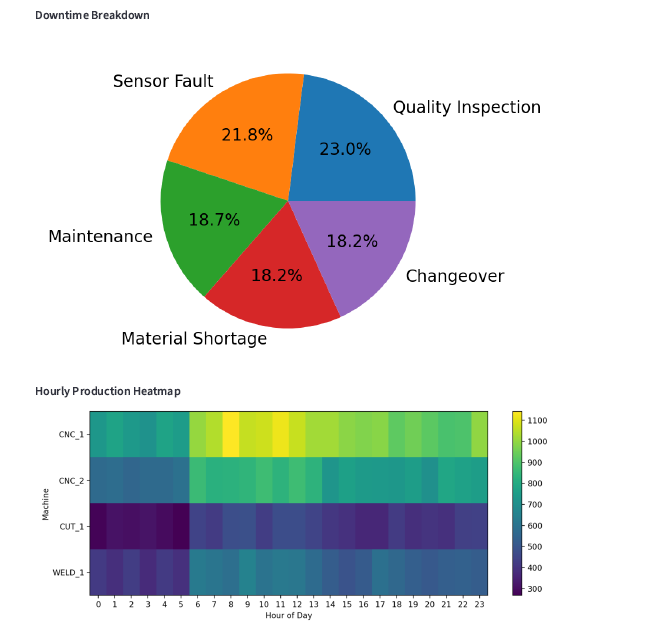
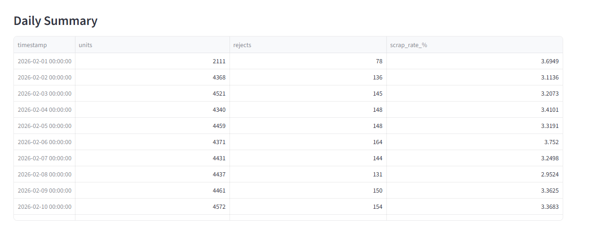

# Factory KPI Dashboard

This project demonstrates a smart manufacturing analytics dashboard built using Python and Streamlit.

## Features
- OEE-style metrics
- Downtime Pareto chart
- Production trend analysis
- Machine/date filtering

## Technologies
- Python
- pandas
- Streamlit
- matplotlib

## How to Run
1. pip install pandas streamlit matplotlib numpy
2. streamlit run app.py

# Output

